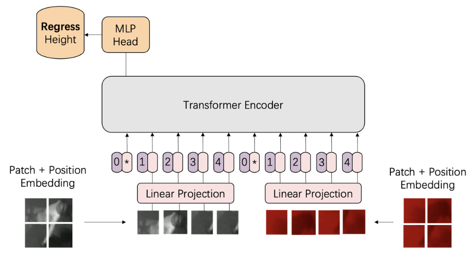

# ViT-Height

In this project, I drew inspiration from several classic networks such as VGG, ResNet, DarkNet, and Transformer. I adapted these networks using multi-modal data (grayscale and depth) to investigate pedestrian height regression.

I modified the popular multi-modal learning model ViLT (Vision-and-Language Transformer) by transforming its original input channels (text and image) into multi-modal images (depth and grayscale). Additionally, I fine-tuned its output for height regression, and I named this modified version ViT-Height.

## Project Structure

- **models**
  - `ViT-Height.py`: Implementation of the modified ViTL model for height regression.
  - `darknet53.py`: Implementation of the DarkNet53 model for height regression.
  - `resnet50.py`: Implementation of the ResNet50 model for height regression.
  - `vgg16.py`: Implementation of the VGG16 model for height regression.
  - `.DS_Store`: macOS system file, can be ignored.
- `README.md`
- `ViT-Height.png`
- `data.ipynb`: Jupyter notebook for data preprocessing and exploration.
- `train.ipynb`: Jupyter notebook for model training.

## Usage

1. Clone the repository: `git clone https://github.com/rachelxhoot/ViT-Height.git`
2. Explore the `models` directory for various network implementations.
3. Refer to `data.ipynb` for data preprocessing and exploration.
4. Use `train.ipynb` for training the ViT-Height model.

## Model Details

Please click [here](https://rachelxhoot.com/ViT-Height-939d9f7563984179bdfd8399b1d0e5ab) for more details!

